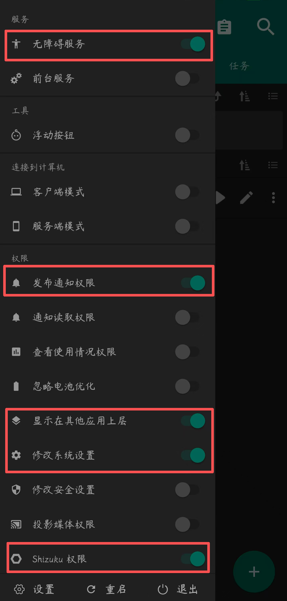
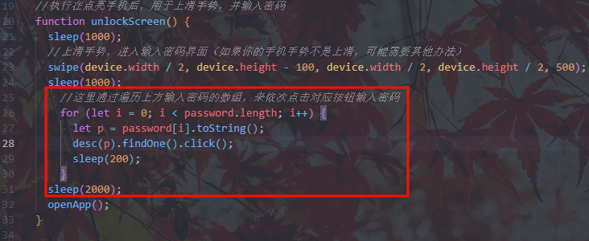
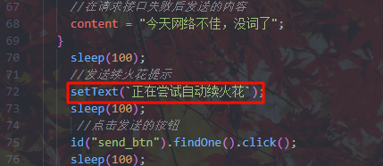
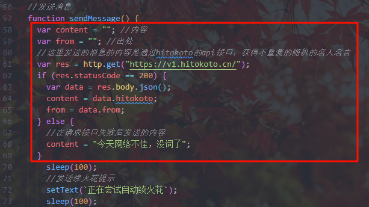
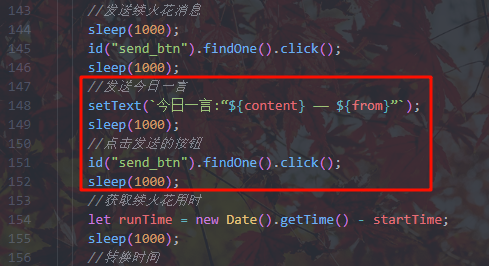
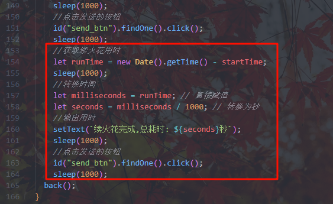

# AutoJS6快手自动续火花

readme文档编写时间：2025年8月22日23点28分

#### 前言

本作品是基于[AutoJS6抖音自动续火花](https://gitee.com/ewaaa/auto-js6-tiktok-auto-spark)二改制作的快手自动续火花

原作者bilibili：[LuckyLK-个人主页-哔哩哔哩视频](https://space.bilibili.com/515953193?spm_id_from=333.1007.0.0)

#### 介绍

bilibili视频介绍：[快手自动续火花脚本-介绍](https://www.bilibili.com/video/BV11beMzNEgS)

###### 本二改版本的熄屏方式采用模拟电源按键熄屏，由于安卓内部的安全限制，需要使用shizuku给予权限，或使用root给予权限，如果你启动了***自动熄屏***并且时间很短，那当我没说，*可忽视*“使用说明第二条“，可不在第三条的图片中打开“shizuku权限”

#### 软件架构：

[AutoJs6](https://github.com/SuperMonster003/AutoJs6)

JavaScript

#### 使用说明：

1. 安装AutoJS6[点此跳转releases下载](https://github.com/SuperMonster003/AutoJs6/releases)

2. 安装shizuku[点此跳转releases下载](https://github.com/RikkaApps/Shizuku/releases)，并且启用，启用教程可以看这位大佬的视频 [安卓免root神器，Shizuku全机型激活教程！](https://www.bilibili.com/video/BV1Ac1dYSELU?vd_source=5d390e1251e1b33bfb2306c8a255e726)确保Auto.js可以获取shizuku权限(注意这个要根据你个人的手机情况而定，Root用户可跳过这一步，其他用户建议根据后面的提示来酌情考虑)

3. 设置autojs权限，下图圈出了该脚本所需的权限

   

4. 选择合适的脚本复制到你的autojs下

5. 填写需要填写的内容，例如好友昵称，锁屏密码

6. 运行脚本
   **如果以上教程看不懂可以看视频版**

[快手自动自动续火花-教程(哔哩哔哩观看)](https://www.bilibili.com/video/BV1J5Y9zEECi/)	     
[快手自动自动续火花-教程(快手观看)](https://www.kuaishou.com/short-video/3xywczexb6t35cw)

#### 脚本所需权限

##### 下列权限是需要给Autojs应用给予的权限，不给予可能导致脚本无法使用

1. 无障碍权限

2. 应用自启动

3. 后台无限制

4. 获取应用列表

5. 媒体音量控制

6. 后台弹出界面

7. 显示悬浮窗

8. 允许通知

9. 修改系统设置

***其他非系统权限***(二选一，需要根据你实际个人手机情况和选择的脚本版本来选择，如果你手机本身开着自动熄屏且时间很短可都不选)

1. shizuku权限
2. Root权限

#### 下载或复制代码：

两个版本本质上只是模拟熄屏按键的代码不同，也就是最后一行，如只使用无障碍权限授权，且开着手机自动熄屏时长比较短，可复制任意一种版本的代码，删除最后一行

**shizuku版：**[快手自动续火花脚本-shizuku](快手自动续火花脚本-shizuku.js)

**Root版：**[快手自动续火花脚本-Root](快手自动续火花脚本-Root.js)

#### 注意事项：

1. 如果你不需要使用密码打开手机，而是直接滑动解锁，请删除红色方框内的代码
2. 请勿同时运行多个重复脚本
3. 脚本运行过程中请勿进行任何操作
4. **测试使用版本**： autojs版本6.6.4   快手版本13.7.30.10493
5. 若新版本的脚本使用有问题，例如通过按钮名称自动寻找按钮位置点击无法生效，请尝试修改部分点击坐标的位置
6. 需将发送消息的方式修改为发送按键
7. 确保给予shizuku或Root权限

#### 常见问题回答：

Q: autojs如何下载安装使用？

A: 这个你可以去查相关教程，都特别详细，简直是保姆级教程。

Q: 这个脚本可以给多个人发送消息吗？

A: 暂未测试

Q: 脚本发送的内容可以自定义吗？

A: 这里修改发送的第一句
   
   
   
   这里修改发送的一言，删除后不会输出一言，但还会发送原始变量
   
   
   
   删除这里彻底关闭一言
   
   
   
   删除这里关闭续火花时长告知对方
   
   

Q: 如何知道我手机点击位置的坐标？

A: 开发者模式，打开显示坐标功能，具体步骤可以自己查询。

Q: 我不会使用shizuku，手机又没root怎么办？

A: **本二改版本的熄屏方式采用模拟电源按键熄屏，由于安卓内部的安全限制，需要使用shizuku给予权限，或使用root给予权限，如果你启动了“自动熄屏”，那当我没说，可忽视“使用说明第二条“，可不在第三条的图片中打开“shizuku权限”**

Q: 为什么脚本需要这么高的权限，有没有不需要高权限的版本？

A: 脚本需要的权限是模拟电源按键熄屏，如果没有这个权限，脚本将无法给手机熄屏，目前正在尝试采用第三方的“一键熄屏”但由于测试时，无法通过app.launchApp方法打开一键锁屏，估方法可能失效，又因为原作者的熄屏方式也无效，所以暂采取模拟电源按键熄屏的方式，需要root或shizuku权限，当然如果你手机开着自动熄屏且时长很短，可不给shizuku和Root权限，但我还是建议有Root的给Root权限，这样可以保证Autojs的软件无障碍一直存在

#### 重要提示：

##### 在下载、安装或使用本脚本（以下简称“脚本”）之前，请您务必仔细阅读并充分理解[用户使用协议](LICENSE.md)的所有条款。您的下载、安装或使用行为即被视为您已完全阅读、理解并同意接受本协议的全部条款约束。如果您不同意本协议的任何内容，请立即停止使用并删除本脚本。

