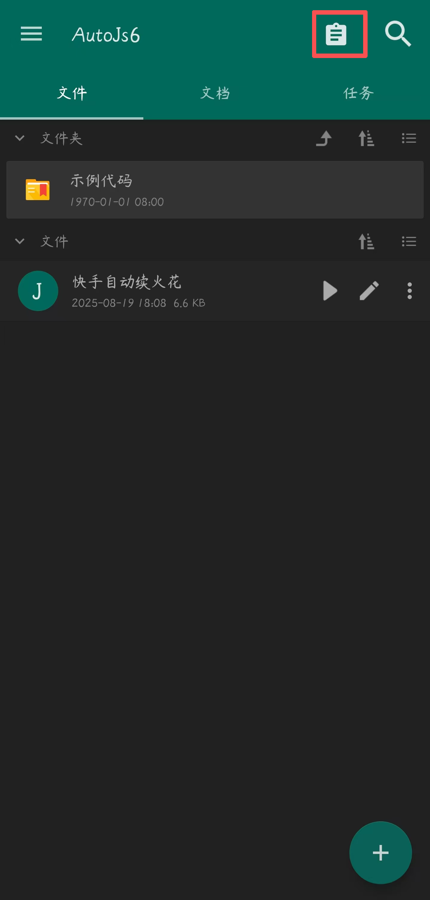
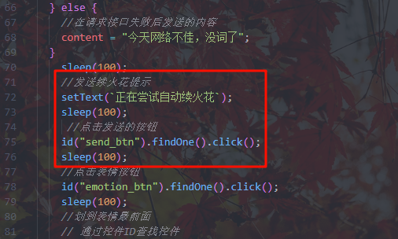

  

  

    
    
    
    
     
    
    
    <a href='https://gitee.com/coldestbow30654/automatic-spark-renewal/stargazers'></img></a>
    <a href='https://gitee.com/coldestbow30654/automatic-spark-renewal/members'></img></a>
  

#### 前言:

本作品是基于[AutoJS6抖音自动续火花](https://gitee.com/ewaaa/auto-js6-tiktok-auto-spark)二改制作的快手自动续火花

灵感来源：[LuckyLK](https://www.bilibili.com/video/BV1zb3xzUEXj)

#### 介绍:

bilibili视频介绍：[快手自动续火花脚本-介绍](https://www.bilibili.com/video/BV11beMzNEgS)

#### 软件架构：

[AutoJs6](https://github.com/SuperMonster003/AutoJs6)

JavaScript

#### 使用说明：

**看不懂可以用懒人版，但稳定性较差，不过不需要多余的软件，只要下载Autojs6即可**

[快手自动续火花脚本-懒人版(文字版教程)](.document/Document-Lazy.md)

**您可以访问每个版本专属的文字版教程**

[快手自动续火花脚本-shizuku(文字版教程)](.document/Document-shizuku.md)
[快手自动续火花脚本-Root(文字版教程)](.document/Document-Root.md)   

**如果以上文字版教程看不懂可以看视频版**

[快手自动自动续火花-教程(快手观看)](https://www.kuaishou.com/short-video/3xywczexb6t35cw)
[快手自动自动续火花-教程(哔哩哔哩观看)](https://www.bilibili.com/video/BV1J5Y9zEECi/)	  

#### 问题反馈:

**如果你遇到脚本运行时产生的问题可以在以下提到的方式向我反馈**

1. 在快手平台向我提交私信

2. 在快手平台中我的相关视频评论

3. 在哔哩哔哩平台向我提交私信

4. 在哔哩哔哩平台中我的相关视频评论

5. 在GitHub中的项目里提交issue

   [Issues · COLDESTBOW30654/Automatic-spark-renewal](https://github.com/COLDESTBOW30654/Automatic-spark-renewal/issues)

6. 在Gitee中的项目里提交issue

   [Issues · 白鹿原嚒/automatic-spark-renewal - Gitee.com](https://gitee.com/coldestbow30654/automatic-spark-renewal/issues)

7. 发送邮件到我的邮箱：<EMAIL>automatic-spark-renewal@hengduan.dpdns.org

###### 在反馈时可以使用开发版[(点我跳转开发版)](/.code/快手自动续火花脚本-开发版.js)先运行一遍，然后向我反馈的时候附赠运行日志

点击展开或收起样例展示

   

       
      
   

#### 脚本所需权限:

##### 下列权限是需要给Autojs应用给予的权限，不给予可能导致脚本无法使用

1. 无障碍权限

2. 应用自启动

3. 后台无限制

4. 获取应用列表

5. 媒体音量控制

6. 后台弹出界面

7. 显示悬浮窗

8. 允许通知

9. 修改系统设置

***其他非系统权限***(根据你阅读的文档来判断是否需要给予，如果你手机本身开着自动熄屏且时间很短可不选)

- shizuku权限

#### 下载或复制代码：
###### 这里不提供懒人版，懒人版在"懒人版文字教程"提供复制
两个版本本质上只是模拟熄屏按键的代码不同，也就是最后一行，如只使用无障碍权限授权，且开着手机自动熄屏时长比较短，可复制任意一种版本的代码，删除最后一行

**shizuku版：**[快手自动续火花脚本-shizuku](.code/快手自动续火花脚本-shizuku.js)

**Root版：**[快手自动续火花脚本-Root](.code/快手自动续火花脚本-Root.js)

#### 注意事项：

1. 如果你不需要使用密码打开手机，而是直接滑动解锁，请删除红色方框内的代码
2. 请勿同时运行多个重复脚本
3. 脚本运行过程中请勿进行任何操作
4. **测试使用版本**： autojs版本[(6.6.4)](https://pan.huang1111.cn/s/byQ1qcY)   快手版本[(13.7.30.43728)](https://pan.huang1111.cn/s/Wz33Pf3)    理论上支持所有快手版本，只要快手界面不进行特别大的改动都可以支持
5. 若新版本的脚本使用有问题，例如通过按钮名称自动寻找按钮位置点击无法生效，请尝试修改部分点击坐标的位置
6. 需将发送消息的方式修改为发送按键
7. 确保给予shizuku或Root权限

#### 常见问题回答：

Q: autojs如何下载安装使用？

A: 这个你可以去查相关教程，都特别详细，简直是保姆级教程。

Q: 这个脚本可以给多个人发送消息吗？

A: 暂未测试

Q: 脚本发送的内容可以自定义吗？

A: 你可以根据下列图片来修改部分脚本发送的文本

   这里修改发送的第一句

   

   删除这里关闭自动续火花提示

   

   这里修改发送的一言，删除后不会输出一言，但还会发送原始变量

   

   删除这里彻底关闭一言

   

   删除这里关闭续火花时长告知对方

   

Q: 如何知道我手机点击位置的坐标？

A: 开发者模式，打开显示坐标功能，具体步骤可以自己查询。

Q: 我不会使用shizuku，手机又没root怎么办？

A: **用懒人版，但目前稳定性低**

Q: 为什么脚本需要这么高的权限，有没有不需要高权限的版本？

A: 有的有的，去看懒人版，但目前稳定性低

Q: 为什么脚本要这么高的权限

A: 脚本需要的权限是模拟电源按键熄屏，如果没有这个权限，脚本将无法给手机熄屏，目前正在尝试使用第三方的“一键熄屏”但由于测试时，无法通过app.launchApp方法打开一键锁屏，估方法可能失效，又因为原作者的熄屏方式也无效，所以暂采取模拟电源按键熄屏的方式，需要root或shizuku权限，当然如果你手机开着自动熄屏且时长很短，可不给shizuku和Root权限，但我还是建议有Root的给Root权限，这样可以保证Autojs的软件无障碍一直存在

#### 重要提示：

##### 在下载、安装或使用本脚本（以下简称“脚本”）之前，请您务必仔细阅读并充分理解[用户使用协议](LICENSE.md)的所有条款。您的下载、安装或使用行为即被视为您已完全阅读、理解并同意接受本协议的全部条款约束。如果您不同意本协议的任何内容，请立即停止使用并删除本脚本。

